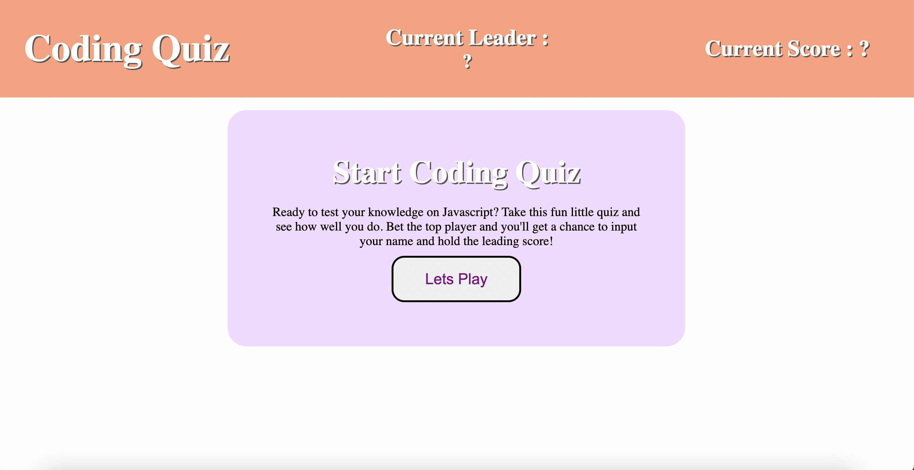

# Coding Quiz

## Description

This is a fun little quiz about javascript! Click the start button to begin and the timer will start from 100 seconds. For each correct answer, you will gain 10 points. However, for each wrong answer the timer will be deducted 10 seconds from the timer but your score will not be affected. Try to score up to 50 points to reach the winning title! If you beat the leading score you'll have the chance to input your name and be displayed at the top as the leading player!

## Usage

The following links reach my deployed webpage and github repo page

- [Deployed Webpage](https://vchan852.github.io/coding-quiz)
- [Github Repo](https://github.com/vchan852/coding-quiz)

## Images

Picture displays the preview of the coding quiz.